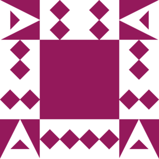

## Description of project
The aim of this project was to fully develop an app for organizing your tasks and schedule, "Talio".
The team consisted of 6 students who, over the span of 10 weeks, have contributed to all aspects of the project (devops, front-end, back-end etc).
 
## Group members

| Profile Picture                                                                           | Name                                   | Email                                           |
|-------------------------------------------------------------------------------------------|----------------------------------------|-------------------------------------------------|
|                         | Ewout de Dobbelaar                     | e.w.dedobbelaar@student.tudelft.nl              |
|                        | ALEXIS FIMEYER                         | a.h.p.a.fimeyer@student.tudelft.nl              |
|  | Farhan Farhan Taufiqillah Lingga Djaya | farhantaufiqillahlinggadjaya@student.tudelft.nl |
|                         | Rares Serban                           | R.Serban@student.tudelft.nl                     |
|                           | Max Eradus                             | M.T.J.eradus@student.tudelft.nl                     |
|                        | Samuel van den Houten                  | s.e.vandenhouten@student.tudelft.nl |

## How to run it
Launch the server by running : ``server.Main`` , once running, you can launch the client by running : ``client.Main``, then the app should be fully usable.

## Copyright / License (opt.)

License / Copyright

This project is licensed under the OOPP license, which can be found nowhere in the root directory of this repository.

Copyright 2023

Max Eradus, Rares Serban, Alexi FIMEYER, Ewout de Dobbelaar, Farhan Farhan Taufiqillah Lingga Djay, Samuel van den Houten hold the copyright for this project. All rights reserved.

Permission is hereby granted, free of charge, to any person obtaining a copy of this software and associated documentation files, to use, copy, modify, merge, publish, distribute, sublicense, copies of the Software, subject to the following conditions:

The above copyright notice and this permission notice shall be included in all copies or substantial portions of the Software.

THE SOFTWARE IS PROVIDED "AS IS", WITHOUT WARRANTY OF ANY KIND, EXPRESS OR IMPLIED, INCLUDING BUT NOT LIMITED TO THE WARRANTIES OF MERCHANTABILITY, FITNESS FOR A PARTICULAR PURPOSE AND NONINFRINGEMENT. IN NO EVENT SHALL THE AUTHORS OR COPYRIGHT HOLDERS BE LIABLE FOR ANY CLAIM, DAMAGES OR OTHER LIABILITY, WHETHER IN AN ACTION OF CONTRACT, TORT OR OTHERWISE, ARISING FROM, OUT OF OR IN CONNECTION WITH THE SOFTWARE OR THE USE OR OTHER DEALINGS IN THE SOFTWARE.

For further details, please refer to the non-existant license file.

